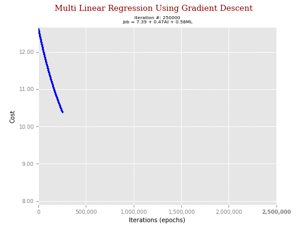
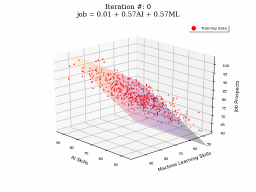

<h2>MachineLearning-MultiLinearRegressionWithGradientDescent</h2>
<h3>Description:</h3>
<ul style="list-style-type:disc">
<li>Python script to estimate coefficients for multilinear regression using gradient descent algorithm. </li>
<li>Linear regression implemented from scratch.</li>
<li>Using simulated data of job prospects given AI and machine learning skills.</li>
</ul>

  
  

<u>Where:</u> 
y is the target, 

 is the intercept (bias value)
 
W is a vector parameters (weights) <strong>to be estimated</strong>.

 
X is a matrix of 1's and K feature weights and N data points of <strong>given inputs</strong>

 
 
 and  is a vector of estimation errors denoted
 

 
<ul style="list-style-type:disc">
	<li>The loss function chosen is <strong>minimum mean square error</strong> given by:</li>
</ul>

<ul style="list-style-type:disc">
	<li>With partial derivatives</li>
</ul>

<ul style="list-style-type:disc">
 <li>With weight updates given by:</li>
</ul>

<ul style="list-style-type:disc">
	<li>Where  is the <em>"learning weight".</em>
</ul>

 
<h3>How to use</h3>
<pre>
python mulitpleLinearRegression.py
</pre>
		
		
<h3>Expected Output</h3>
<pre>
=======================================================================
MULTI LINEAR REGRESSION USING GRADIENT DESCENT TERMINATION RESULTS
=======================================================================
Initial Weights were:             0.0, 0.0, 0.0.
   With initial cost:          3281.9.
        # Iterations:       2,500,000.
       Final weights:    w0:+24.94, w1:+0.32, w2:+0.483.
          Final cost:            +8.1.
                RMSE:            +4.0, R-Squared:         +0.7
=======================================================================
Finished
</pre>

<h3>Requirements</h3>
 
<a href="https://www.python.org/">Python (>2.7)</a>, <a href="http://www.numpy.org/">Numpy</a> and <a href="https://pandas.pydata.org/">Pandas</a>.

 
 
